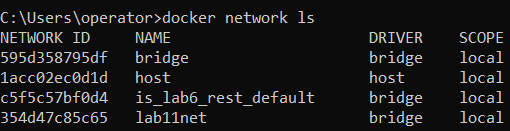
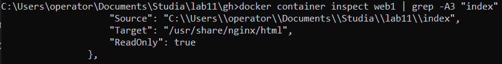
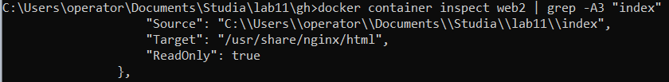
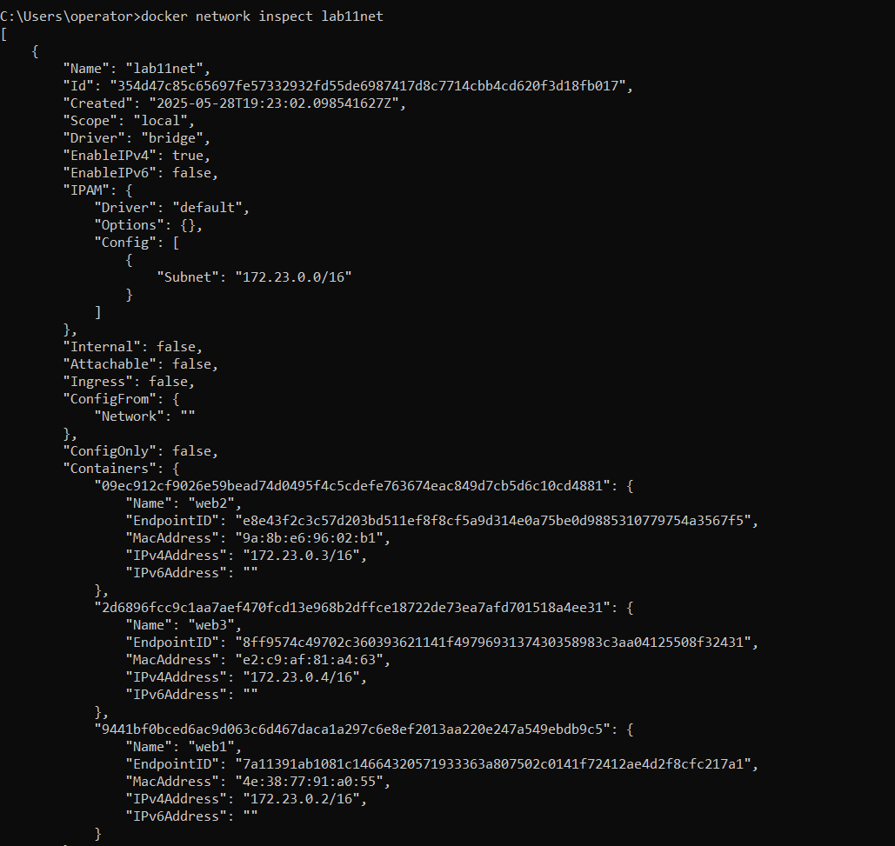
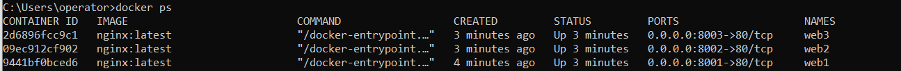
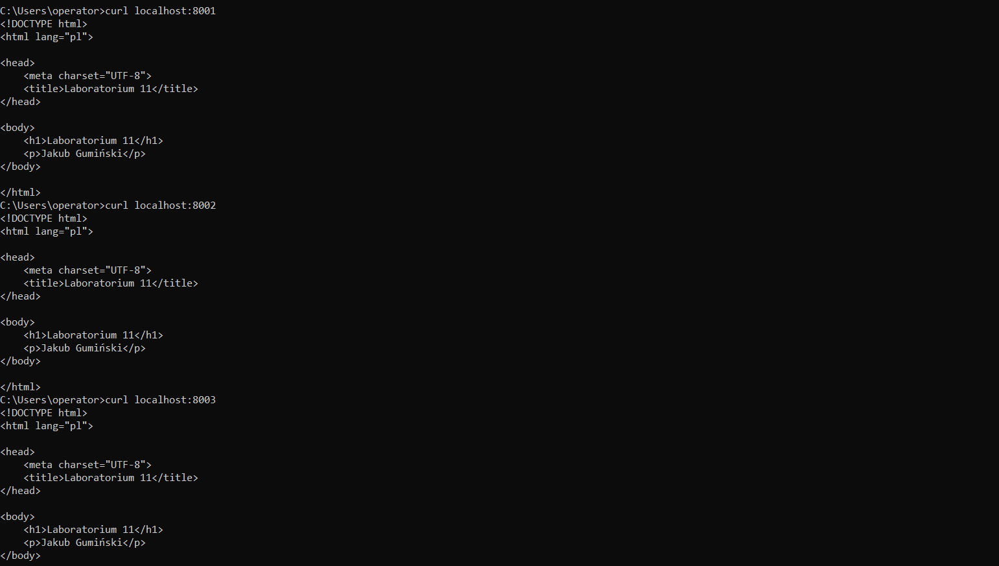

# PAwChO laboratorium 11 - sprawozdanie

## Utworzenie sieci

```
docker network create --driver=bridge --subnet=172.23.0.0/16 lab11net
```



## Uruchomienie kontenerów

### web1

```
docker run -d --name web1 --network lab11net --ip=172.23.0.2 -p 8001:80 --mount type=bind,source="C:\Users\operator\Documents\Studia\lab11\index",target=/usr/share/nginx/html,readonly --mount type=bind,source="C:\Users\operator\Documents\Studia\lab11\w1_logs",target=/var/log/nginx nginx:latest
```



### web2

```
docker run -d --name web2 --network lab11net --ip=172.23.0.3 -p 8002:80 --mount type=bind,source="C:\Users\operator\Documents\Studia\lab11\index",target=/usr/share/nginx/html,readonly --mount type=bind,source="C:\Users\operator\Documents\Studia\lab11\w2_logs",target=/var/log/nginx nginx:latest
```



### web3

```
docker run -d --name web3 --network lab11net --ip=172.23.0.4 -p 8003:80 --mount type=bind,source="C:\Users\operator\Documents\Studia\lab11\index",target=/usr/share/nginx/html,readonly --mount type=bind,source="C:\Users\operator\Documents\Studia\lab11\w3_logs",target=/var/log/nginx nginx:latest
```


### Sprawdzenie szczegółów sieci lab11net



### Działanie kontenerów






## Struktura folderów wraz z obecnymi w nich plikami (potwierdzenie zapisania logów)


